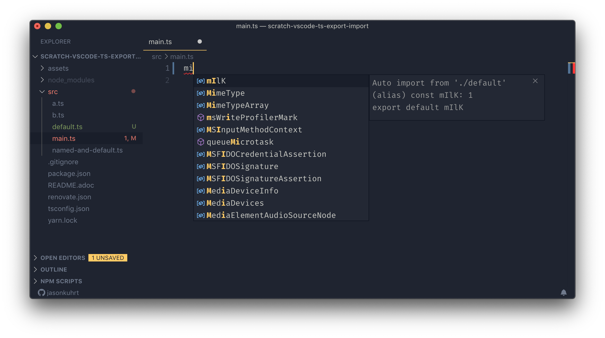
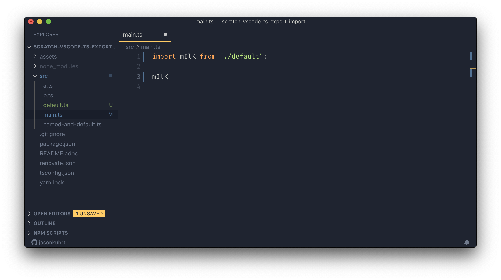

:toc: macro
:toc-title:
:toclevels: 99

# TS + VSCode Import/Export

VSCode `1.38.0` TypeScript `3.6.3`

Test drive the import/export space of TS and VSCode workflow support.

toc::[]

## Cases

### Import of default export

##### Result

As expected. The identifier nameused matches how the variable was defined in the source module. Example below makes this clear.

##### Example

### Import of generically named export

##### Result

Multiple auto-import hints. User can differentiate by going over each option and seeing the `from` differences. Does not import qualified. As a user, working with generic names intended to work by namespace, this is probable not what you want. Namespaced auto-import is an link:#namespaced-auto-import[open issue on TS repo].

##### Example

image::assets/generic-autoimport-hint2.png[]
image::assets/generic-autoimport-hint1.png[]
image::assets/generic-autoimport-result.png[]

> What the user probably actually wanted. Namespaced auto-import is an link:#namespaced-auto-import[open issue on TS repo]

image::assets/generic-autoimport-actually-desired.png[]

### Import of something that is both a named & default export

##### Result

VSCode presents two auto-complete hints. Selecting either produces same result: Import of the default export. Default export seems to shadow named one. Two hint given suggets VSCode is aware of the duality, but fumbles thereafter.

Slightly buggy. Presumably non-issue in near future. OK if named import is not common case.

##### Example

image::./assets/named-and-default-1.png[]
image::assets/named-and-default-2.png[]
image::assets/named-and-default-result.png[]

### Import of named export from module including default export

##### Result

As expected.

##### Example

image::assets/import-from-named-default-module.png[]
image::assets/import-from-named-default-module-result.png[]

## Links

#### Namespaced Auto-Import

- https://github.com/microsoft/TypeScript/issues/23830[Namespaced Auto-Import 1]
- https://github.com/microsoft/TypeScript/issues/19630[Namespaced Auto-Import 2]

#### Other

- https://twitter.com/sebmarkbage[Sebastian Markbåge] has stated (cannot find tweet link) that default exports were probably a language mistake, driven mostly by wide spread use of the pattern in Node/CommonJS]
- https://basarat.gitbooks.io/typescript/docs/tips/defaultIsBad.html[(Living Document) Basarat Against Defaults]
- https://humanwhocodes.com/blog/2019/01/stop-using-default-exports-javascript-module[(2019) Nicholas C. Zakas Against Defaults (long detailed article)]
+
There is a factual mistake in this article:
+
> This type of functionality isn’t possible when using default exports because there is no canonical name for things you want to import.
+
It is, as we saw link:#import-of-default-export[above].
