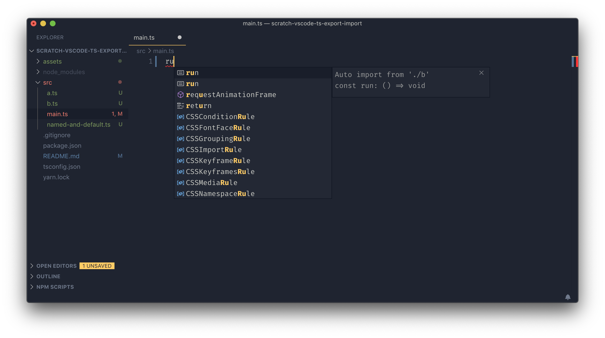
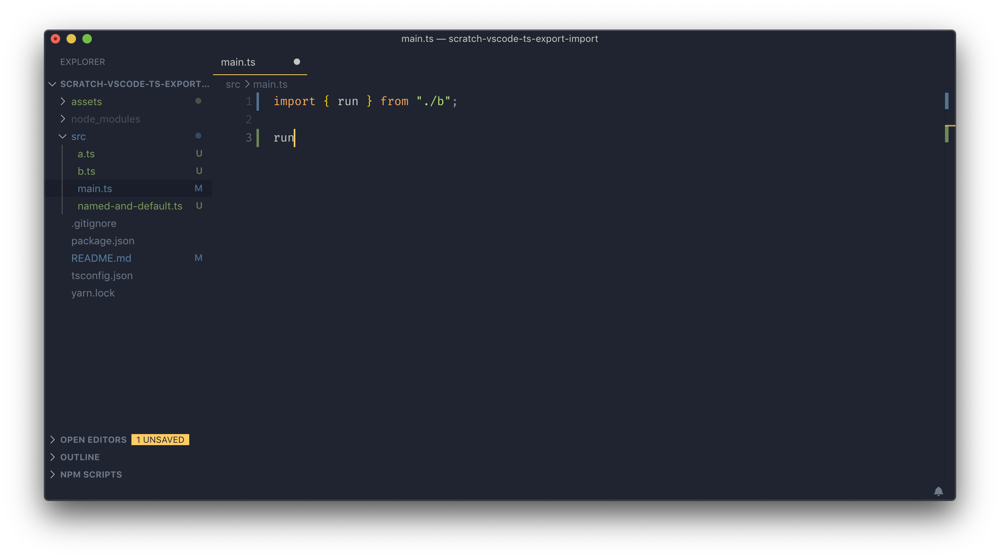
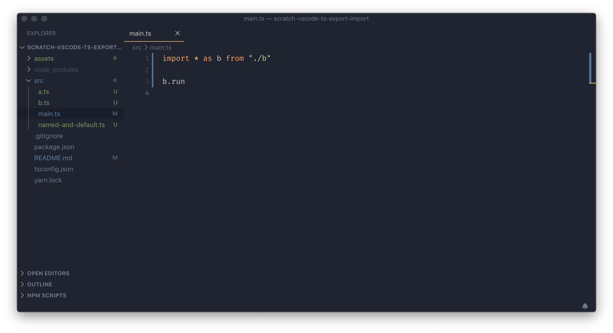
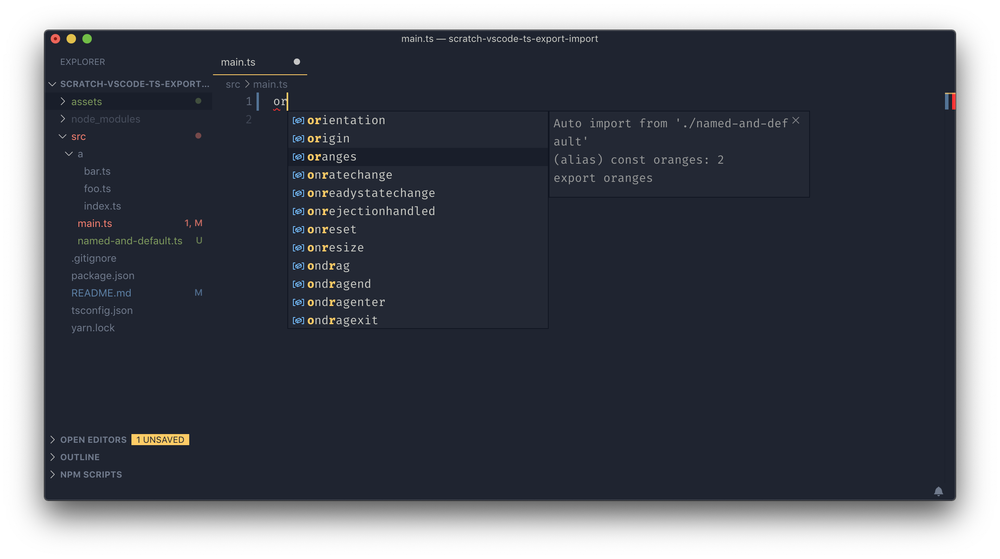
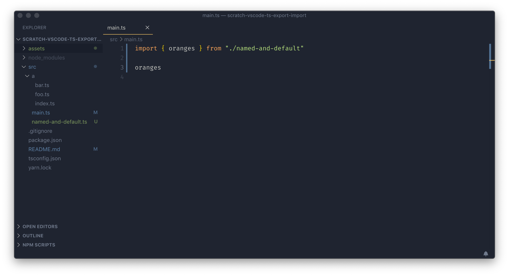
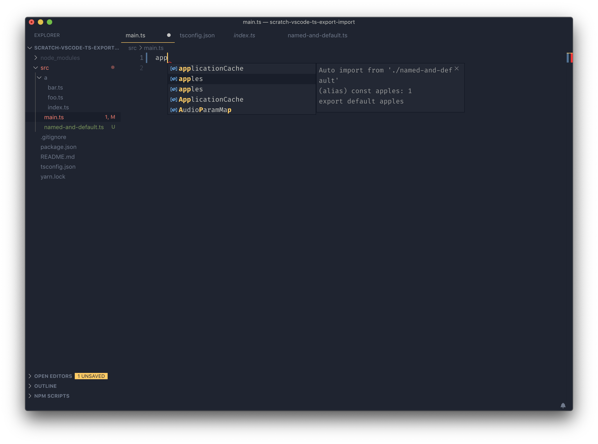
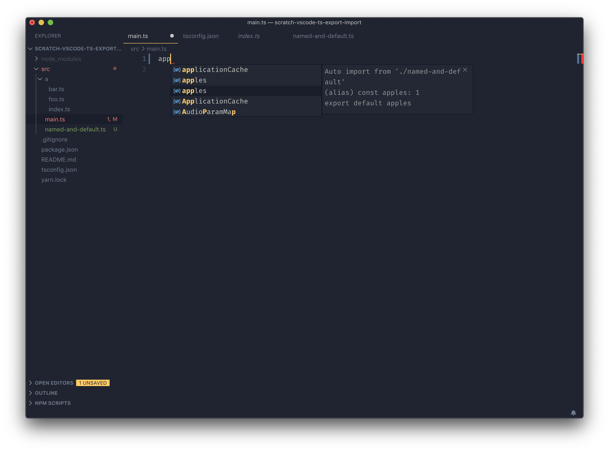
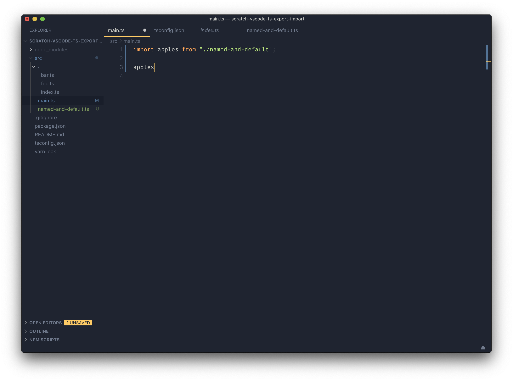

:toc: macro
:toc-title:
:toclevels: 99

# TS + VSCode Import/Export

Test drive the import/export space of TS and VSCode workflow support.

```
VSCode version = 1.38.0
TypeScript version = 3.6.3
```

toc::[]

### Cases

#### Import of generic identifier

##### Result

Multiple auto-import hints. User can differentiate by going over each option and seeing the `from` differences. Does not import qualified. As a user, working with generic names intended to work by namespace, this is probable not what you want. Namespaced auto-import is an [open issue on TS repo](#namespaced-auto-import).

##### Example



image::assets/generic-autoimport-hint2.png[]


> What the user probably actually wanted. Namespaced auto-import is an [open issue on TS repo](#namespaced-auto-import)



#### Import from module with both named & default exports

##### Result

As expected.

##### Example




#### Identifier in both named & default export position

##### Result

VSCode presents two auto-complete hints. Selecting either produces same result: Import of the default export. Default export seems to shadow named one. Two hint given suggets VSCode is aware of the duality, but fumbles thereafter.

Slightly buggy. Presumably non-issue in near future. OK if named import is not common case.

##### Example




### Links

##### Namespaced Auto-Import

- https://github.com/microsoft/TypeScript/issues/23830[Namespaced Auto-Import]
- https://github.com/microsoft/TypeScript/issues/19630[Namespaced Auto-Import 2]

#### Other

- https://basarat.gitbooks.io/typescript/docs/tips/defaultIsBad.html[Basarat Against Defaults and Other Things]
